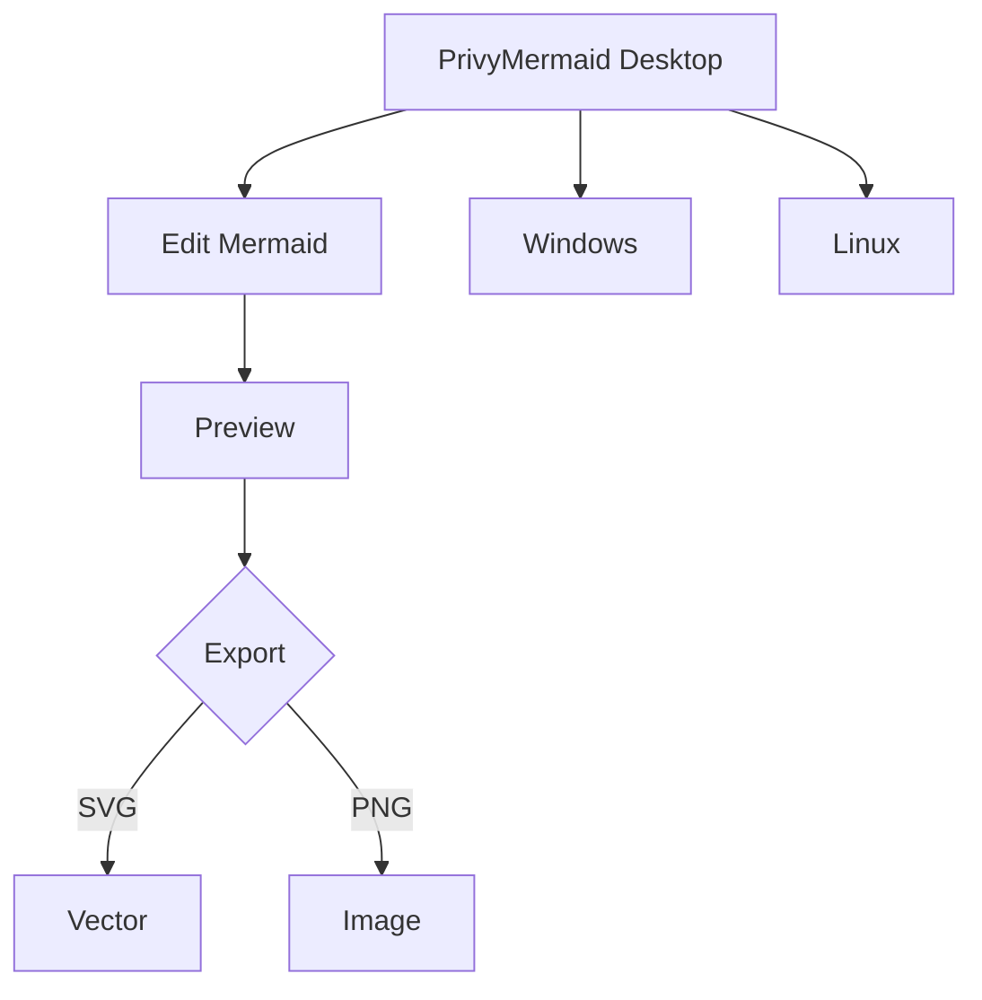

# KTimer architecture
KTimer is a simple object that call functions at the right moment. That's all.

the compler convert relative time to absolute and solve temporal dependencies.

I'm about to switch from a GSAP style into a remotion style because of 2 reasons : it is very hard to seek a given time with GSAP if animation if based on internal function which are not exposet to GSAP.
GSAP is very powerfull, but it look like an overkill and unnecessary complexity for my use case.

